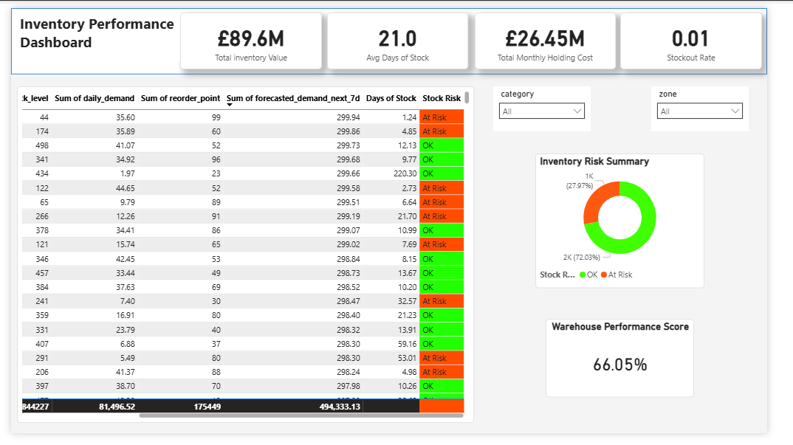

📦 Inventory Performance Dashboard – Power BI Project

A professional, end-to-end Power BI analytics project analysing warehouse inventory performance, including stock levels, risk classification, warehouse efficiency, holding cost, and operational KPIs.
This project demonstrates data modelling, DAX, dashboard design, and business intelligence storytelling — built exactly like a real job scenario.

 🚀 Project Overview
This dashboard enables warehouse and supply-chain leaders to:  
* Monitor real-time inventory value  
* Identify stock at risk before stockouts occur  
* Assess warehouse efficiency & performance  
* Analyse product-level details such as demand, forecast accuracy, reorder thresholds, and replenishment behaviour  
* Support data-driven decision making for procurement and stocking  
* The dataset used is the Logistics Warehouse Dataset sourced from Kaggle.    
  
 🧠 Key Business Questions Answered

✔ What is the total value of the current inventory?  
✔ How many days of stock do we have on average?  
✔ What is the total monthly holding cost?  
✔ What percentage of items are at stockout risk?  
✔ How is inventory risk distributed across products?  
✔ What is the overall Warehouse Performance Score?  

  📊 Final Dashboard Preview

 📐 KPIs in the Dashboard  
KPI  | Description
------------- | -------------
Total Inventory Value | Total financial value of all stock on hand
Avg Days of Stock  | Average days remaining before stockout  
Total Monthly Holding Cost  | Estimated warehouse holding cost
Stockout Rate  | % of items below safety threshold
Warehouse Performance Score  | DAX-generated combined operational score
 
  🧮 DAX Measures Used
 
All DAX formulas are included below:
 👉 [all-measures.txt](PowerBI_Logistics_Warehouse/DAX-measures/01_all-measures.txt)

 📁 Repository Structure
  📦 inventory-performance-dashboard
 │
 ├── 📁 PowerBI
 │   └── Inventory_Dashboard.pbix
 │
 ├── 📁 DAX
 │   └── all-measures.txt
 │
 ├── dashboard.png
 ├── README.md
 └── LICENSE (optional)

 ⚙️ Technical Skills Demonstrated  
 🔹 Power BI

* Data modelling

* DAX calculated measures

* Interactive slicers

* Conditional formatting

* KPI Cards, table visualizations, donut charts

* UX/UI layout for executives

 🔹 Analytics

* Inventory analysis

* Risk scoring

* Forecasting interpretation

* Cost modelling

* Operational performance scoring

 🔹 Professional BI Practices

* Clean, consistent theme

* User-friendly navigation

* Business-oriented insights

* Executive-style presentation

  👤 About the Developer

Schikan (Portfolio Project)
 Aspiring Data Analyst | BI Analyst
 Focused on Power BI, SQL, Azure, and real-world practical analytics.

## 📬 Contact
📧 Email: **schikan@yahoo.co.uk**  
🔗 GitHub: **https://github.com/shikzta**

 📄 License

This project is open for educational and portfolio use.
